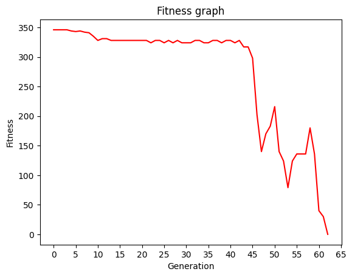

# Using Genetic Programming To Evolve A Robocode Robot

After [63 generations](https://drive.google.com/file/d/11Fd7qNRI3scFRmmJYgjMypMR51-LiJdI/view?usp=sharing), the blue robot evolved to almost always win against the most annoying enemy (Tracker).


The below graph shows how the fitness was changing with every generation. Something important happened around 40th generation.



## The Evolved Program

The [Push](http://pushlanguage.org/) program that the blue robot is using is quite concise:

```push
(integer.ln ((() (((exec.pop integer.yank (integer.ln ((integer.fromboolean exec.y (((exec.pop)) false (exec.stackdepth (robot.turngunright) (exec.stackdepth exec.swap integer.* (exec.stackdepth integer.pow robot.ahead))) robot.turnradarleft (exec.stackdepth integer.rot robot.turnright robot.fire))))))) false (false) robot.turnradarleft (exec.stackdepth integer.rot robot.turnright robot.fire))) integer.stackdepth) integer.=)
```

## How To Run Locally

Create `ROBOCODE_HOME` environment variable set to, e.g., `c:\robocode`.

```
-Xmx512M -Djava.security.manager=allow -XX:+IgnoreUnrecognizedVMOptions "--add-opens=java.base/sun.net.www.protocol.jar=ALL-UNNAMED" "--add-opens=java.base/java.lang.reflect=ALL-UNNAMED" "--add-opens=java.desktop/javax.swing.text=ALL-UNNAMED" "--add-opens=java.desktop/sun.awt=ALL-UNNAMED"
```

Also, since you set `NOSECURITY` to `true`, do not forget to add the next paths to the classpath (see [this issue](https://github.com/robo-code/robocode/commit/cb4e948b7722a897324cdca153576e9f9697898f#diff-2b9254a38f11c2272a48fc059aadb7a0417e84673c531b51686fdf5779c780a8)):

1. `/Users/yaskovdev/robocode/robots`
2. `/Users/yaskovdev/robocode/robots/robocode-push-1.0-SNAPSHOT-jar-with-dependencies.jar`
